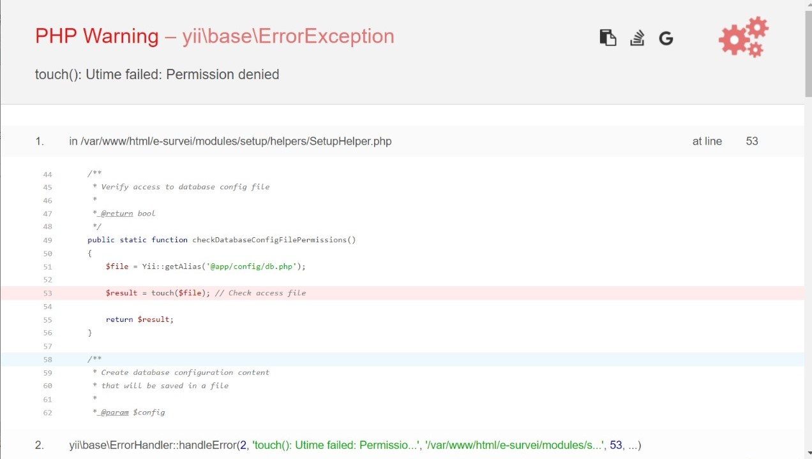

# Regards!

Welcome to the survey installation guide - ANRI

&copy; Rahmat Subandi - 2021

<hr>

# Source Code

The source code files for all of these applications are available on a special GitHub Repo that I have created. To access it requires permission from myself.

[Link Source Code](https://github.com/rahmatsubandi/forum/)

> Make sure your GitHub account has permission from the repo owner.

<hr>

# Starting Installation

## The first stage

> Make sure you have XAMPP and have up / running the local server.
>
> 

1. Download the code

   Please download the file that is on my GitHub repo in the named branch [cms](https://github.com/rahmatsubandi/forum/)

   

2. Create a new folder in htdocs

   After the file has been successfully downloaded, move it to the htdocs directory / folder

   

   For example, when I finished downloading, I created a folder called <b> e-survey </b> in the htdocs folder.

3. Extract files

   - After creating a folder in the htdocs folder open the ZIP file

   

   - Then click the <b> forum-cms </b> folder it will contain:

   

   - Select all the files <b> (ctrl + a) </b> or you can click '<b> Extract To </b>' and select the destination in the directory / folder that was created in htdocs

   

4. Done.

## Second Stage

> Make sure you have completed Stage One correctly! And Xampp is up and running.

1. Create Database

   Open your browser, then go to http://127.0.0.1/phpmyadmin/index.php to create a database

   - Click New to create a new database
     
   - Then create a database (For example I create it with the name <b> e-survey-anri </b>)
     
   - Then press the button <b>create</b>
   - After completion / success, there will be a notification and the page will automatically go to
     

2. Starting the Installation with the Installer

   After successfully creating the database, type http: //localhost/e-survei/install.php in the browser, then the display will look like:
   

   - In the first part there is a choice of language, leave it with the default, which is English. Click the <b> 'Save and continue' </b> button

   > <i>If you experience an error like the image below:
   >
   >  </i>

   So it is necessary to perform / execute the following 3 commands in the terminal:

   ```
    chmod -R 755 nama-file
   ```

   ```
    chown apache:apache nama-file
   ```

   ```
    chown -R apache:apache nama-file
   ```

   - Then in this section the installer will check what requirements are needed, if all the requirements are met, the entire table will be green, as shown below:
     
     Jika semua-nya hijau Klik tombol <b>'Continue'</b>

   - The next stage is database preparation
     

     - In the Input section <b> Database Name </b>, fill in the database name that was created in the first stage, namely <b> e-survey-anri </b>.
       For the <b> Database Username </b> and <b> Database Password </b> sections, just leave the defaults. This is the default database configuration on localhost, unless it is installed on the server it requires appropriate fields and sets the <b> ADVANCED OPTIONS </b> section.
       
     - Then click the test connection button
     - If the configuration is successful, such as the appropriate database name, username database, and password database, a notification will appear / will appear as shown below:
       
     - Then click the <b> Save and continue </b> button

   - Wait for the automatic installation process to complete, when it's finished it will be like this:
     
     Click the <b> Continue </b> button

   - The next process is to create an account for the Super Admin, such as creating an email, username (email and username here will be used to log in), password, and choosing a time zone.
     
     For example, I filled it with:

     - Email : superadmin@anri.com
     - Username : superadmin
     - Password : password
     - Timezone : Asia/Jakarta +07:00

   - Click the <b> Create & continue </b> button

   - Then if the whole installation is successful it will be like:
     
     After that, click the <b> Go to ANRI Survey </b> button

   - Then the display after clicking the <b> Go to ANRI Survey </b> button will be like:
     

## Login

In this section, please enter with the email / username and password that was created during application installation. For example, the account that I have created is like:

- Email : superadmin@anri.com
- Username : superadmin
- Password : password

## Dashboard page

Below is the main page of the dashboard


## Peringatan!

> After entering the dashboard, it's a good idea to delete or change the name of the install.php file to installan.php or whatever, even if it needs to be deleted.

For example, if you are confused:

1. Open the project folder in the htdocs directory
2. Enter the e-survey folder (If your folder name is not the same, please just search. The point is enter into the project folder which contains the extracted code at the beginning of the stage)
3. Find the install.php file

   

4. Then change the name from install.php to installan.php <b> Or you can just delete this install.php file </b>
5. Done. Now you can try or use this ANRI E-survey application safely, and comfortably.

<hr>

# Panduan Penggunaan

# User Roles

1. <b>Admin:</b> A user with access to the entire application, including site configuration, user management and all forms.

2. <b>Basic User:</b> A user who can access the application but do not have access to any information. You should grant access to one or more forms in order to let him see the information. However, in any case, a user can create or manage forms, templates, themes, users or site configuration. This role has been created to allow your customers not only get notifications in their emails, but also access "Survei ANRI" to get more information.

3. <b>Advanced User:</b> Advanced users can create forms and manage them freely. And also they will be able to create their own themes and use them in their forms. Moreover, they can access the Template Manager to create their own templates and use templates created by administrators.
